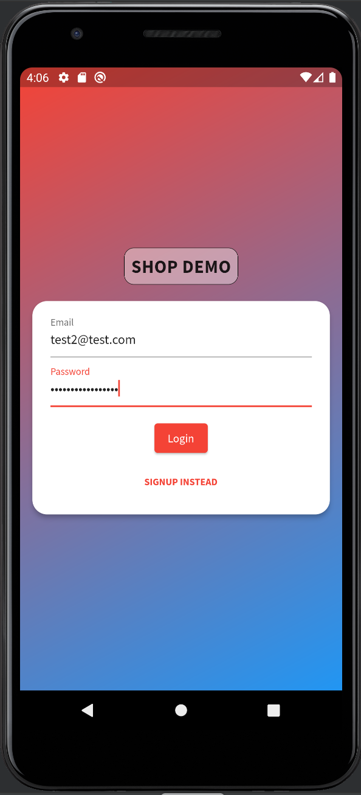
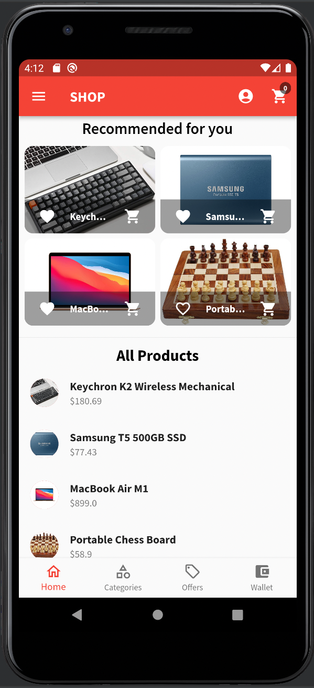
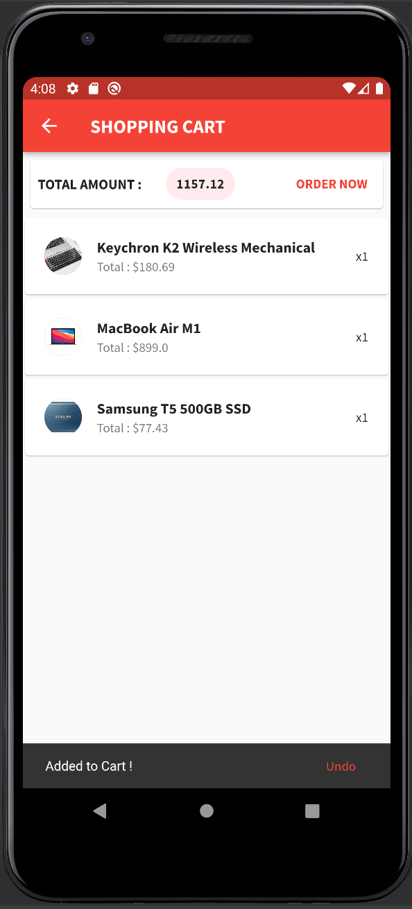
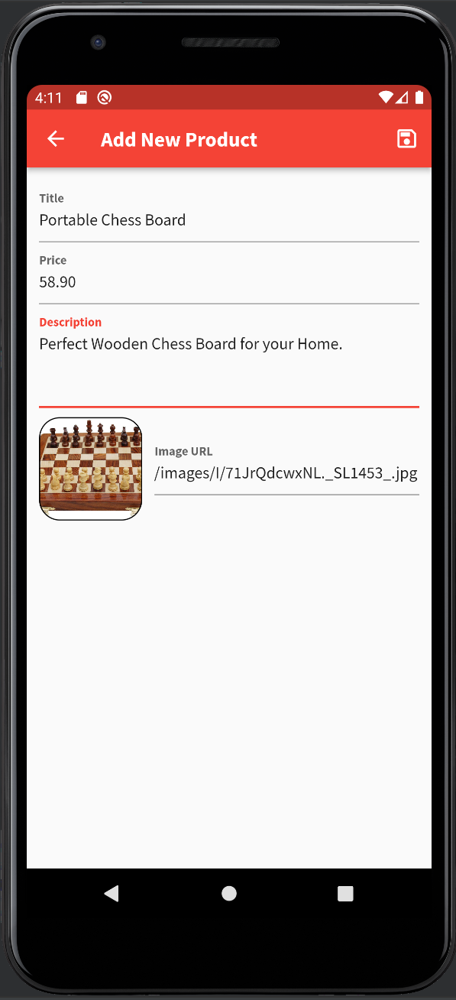

# DEMO SHOP APP

1. Authentication Screen - Signup and Login using Firebase Auth API. 
2. Products Screen - Products are stored on Firebase Realtime Database.
3. Cart Screen - with Ordering Option, Favorites Screen, Order Screen.
4. Product Management Screen - with Add New and Edit Option.
5. Favorites, Cart-Order, Product Management options are USER SPECIFIC.
6. Auto Login, Auto Logout added.
(7). Animation - will be added.

Tech Used : Flutter, Firebase.
Packages Used : Provider - State Management, 
                Shared Preferences - Storing Auth Data on Device.

## Screenshots

